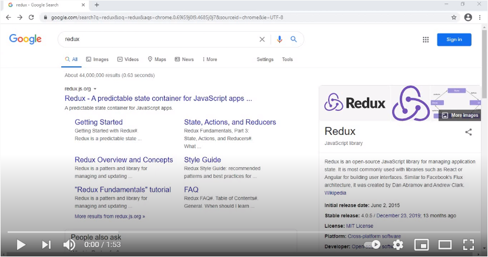

# ReStore
ReStore is a web application (SPA) which is an online store of electronic literature on programming.

This program is written using React and Redux.

<h3>To see how this web application works watch the demo video below.</h3>

<strong>ReStore:</strong>

